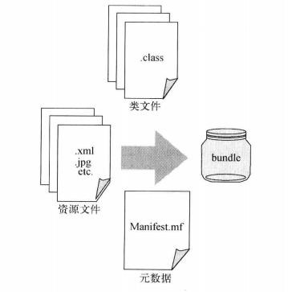
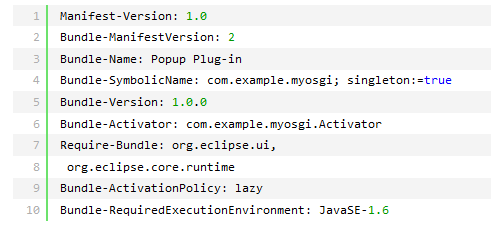
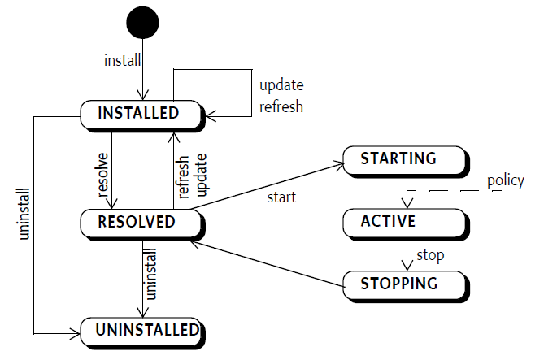

OSGi三层结构
=========

#### 模块层
- 定义了模块化的模型——Bundle。Bundle是开发、部署OSGi应用的基本单元。
- 提供了Bundle的Java包共享、屏蔽的规则。Bundle通过Export-Package、Import-Package和Service等方式进行交互。
- 每个Bundle有单独的类加载器，该机制保证了Bundle间的物理隔离，是OSGi动态能力的基础。

####生命周期层
- INSTALLED：成功安装bundle。
- RESOLVED：所有bundle需要的Java类可用。这个状态标志着bundle已经是启动就绪或者是已经停止。
- STARTING：正在启动bundle。调用了bundle激活器的start方法，而且还没有从方法中返回。
- ACTIVE：bundle已经启动完毕，正在运行中。
- STOPPING：正在停止bundle。调用了bundle激活器的stop方法，而且还没有从方法中返回。
- UNINSTALLED：bundle已经卸载完毕，不能进入其他状态。

#### 服务层
- 定义了动态协作模型，该模型是一个发布、查找和绑定的模型。
- Bundle可以注册服务、搜索服务、监听服务。
- OSGi 4推出了DeclaraPve Services(DS)
- OSGi 4.2企业级规范中引入了Blueprint规范，脱胎于Spring DM，更加简便地定义和使用服务